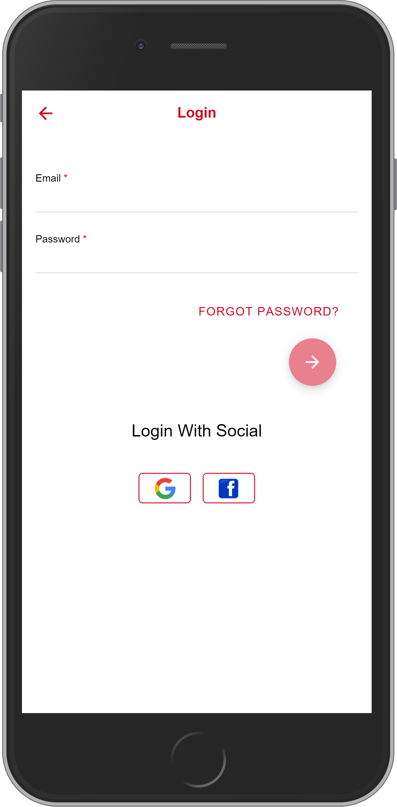
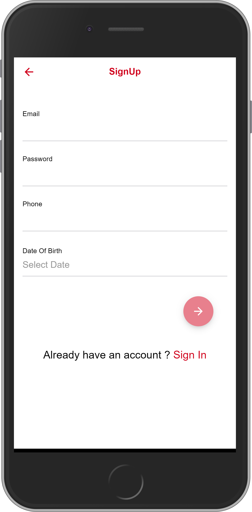
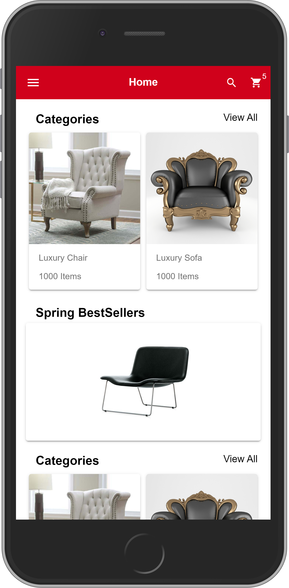
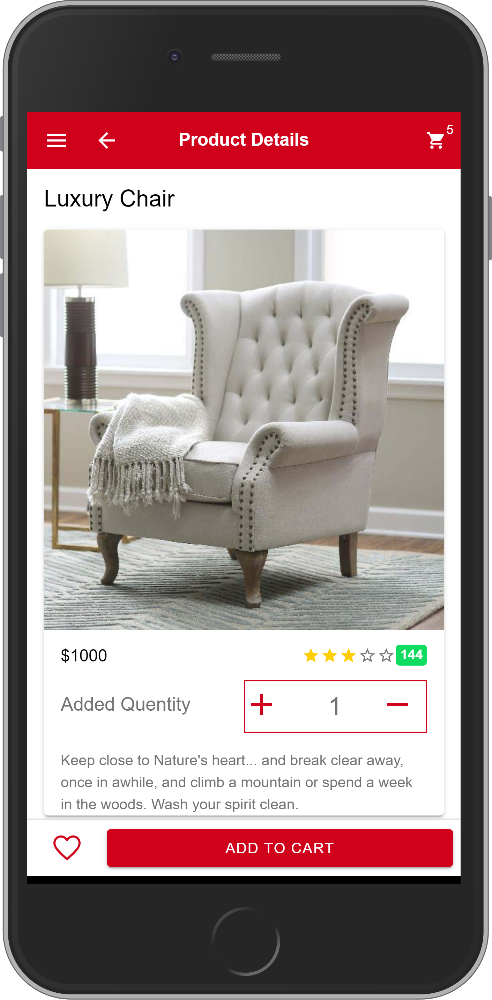
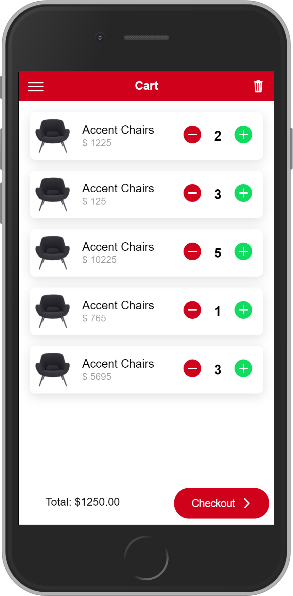
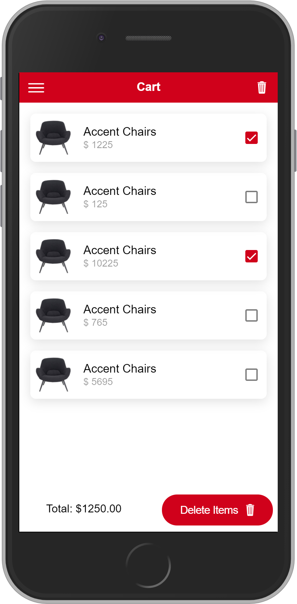
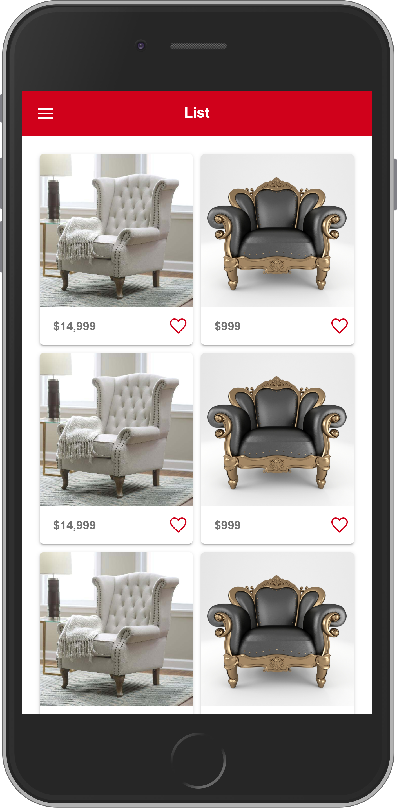
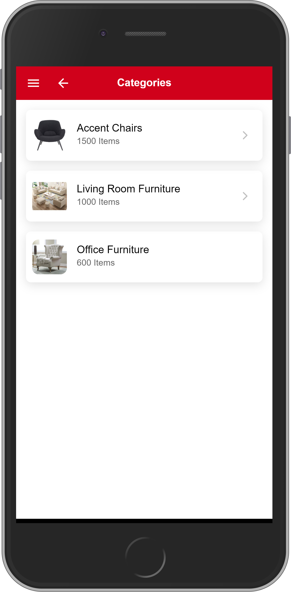
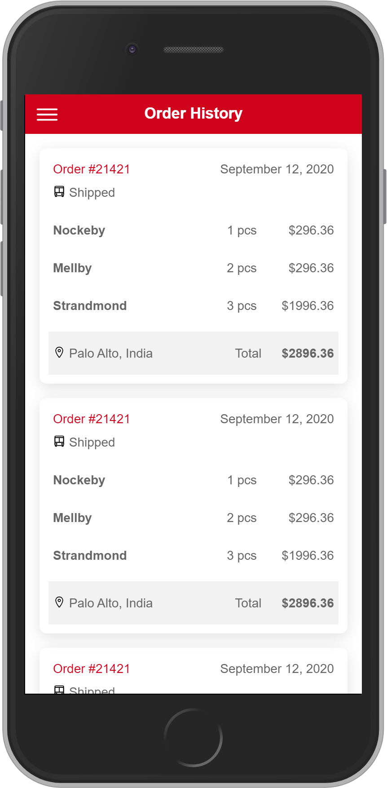

# Furniture Shop

## INSTALL IONIC USING CLI

 [ionic](https://ionicframework.com/docs/v3/intro/installation/)

## SCREEN SHOTS

&nbsp;
&nbsp;
&nbsp;
&nbsp;
&nbsp;
&nbsp;
&nbsp;
&nbsp;


## OPEN PROJECT ON BROWSER

```
ionic serve
```

## ADD ANDROID PLATFORM

```
ionic cordova platform add android
```

## BUILD ANDROID PLATFORM

```
ionic cordova build android
```

## RUN ANDROID PLATFORM

```
ionic cordova run android
```

## How to use

```npm
git clone https://github.com/ravi-ashara/furniture-shop.git
cd furniture-shop
npm i or npm install
ionic serve
ionic cordova build android
ionic cordova run android
```